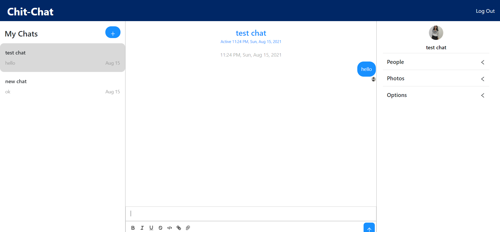

# Chit-Chat
Chatting website using React, Firebase and chatengine.io

## Technologies Used
- ReactJS: Used to beautiful UI
- Sass
- Firebase: Used to implement authentication using Google
- react-chat-engine: npm package for storing messages and rooms easily.

## Project Screenshots

